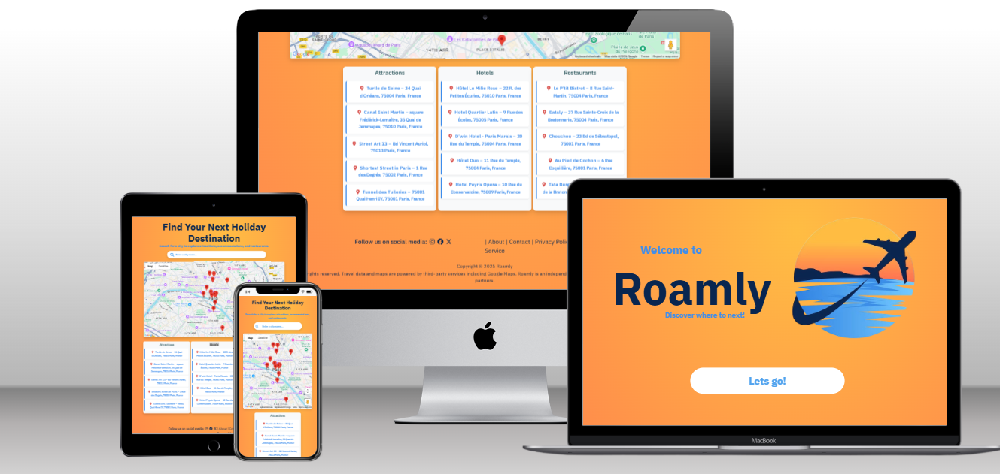
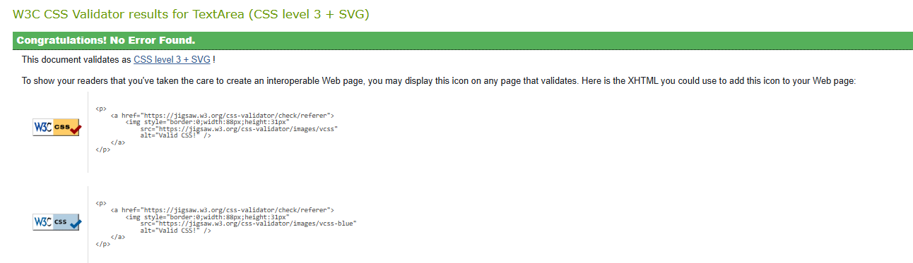
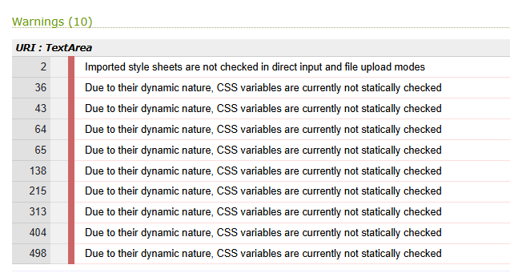
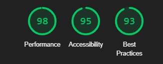
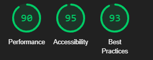

# Roamly – City Explorer Web App

[Link to Live Website](https://daniquej-r.github.io/Milestone-Proj-2/index.html)

[GitHub Repo](https://github.com/DaniqueJ-R/Milestone-Proj-2)

*** 

## About

Roamly is an interactive front-end web application that allows users to explore cities around the world and discover local attractions. Built with HTML, CSS, and JavaScript, the app uses the Google Maps and Places APIs to dynamically load location-specific content based on user input.

***

## Index – Table of Contents

* [User Experience](#user-experience)
     * [Purpose & Audience](#purpose-&-audience)
     * [Project Objectives](#project-objectives)
     * [Features](#features)
     * [Tech Stack](#tech-stack)
* [UX and Design](#ux-and-design)
* [Testing](#testing)
* [Deployment](#deployment)
* [Credits](#credit)

*** 

## User Experience

### Purpose & Audience
Roamly is designed for:

* **Travel enthusiasts** looking to research destinations
* **Casual users** interested in exploring cities interactively
* Users of all technical levels, with a **simple, clean interface** focused on **usability and accessibility**

### Project Objectives

The main goals of Roamly were to:

* Practice DOM manipulation and front-end interactivity
* Use an **external API (Google Places)** to dynamically fetch and render data
* Develop a mobile-responsive UI with basic accessibility features
* Integrate visual feedback (e.g., loading states, error messages)

### Features

* **Live city search** – Users enter a city name to explore
* **Dynamic map generation** via Google Maps API
* **Real-time points of interest** using Places API
* **Error handling** for empty input or invalid cities
* **Clean and responsive UI**, accessible on mobile and desktop

#### Out-of-Scope Features

##### Must

* **Add user login for saving favorite cities** - Allowes users to easly come back and find areas they ere lready interested in

* **Trip Type Selection** - Users can select the type of trip (relaxing, adventurous, cultural, romantic, etc.) to get personalized destination recommendations.

* **Trip Summary & Booking Suggestion** - Allowes user to wrap up planning with a summary and actionable next steps

##### Should

* **Add local weather info via OpenWeather API** - Helps users plan their trips better around weather reports

* **Travel Reminders & Duration Tools** - Gives reminders or tools to help decide how long to stay in each location or plan by days.

##### Could

* **Implement dark mode toggle for accessibility** - General asthetic change for users to change overall site to darker colours (eithher black or dark red)

* **Destination History** - Lets users see where they have searched, or planned to go in the past.

#### Scrapped Scope Features

* **Mood selector for trips**  - Initially, search was going to be mood based, however this was later scrapped for the trip type idea, giving the user easier options to custoomize their stay with.

### Tech Stack

* HTML5 & CSS3 (Flexbox layout, responsive design)
* Bootstrap for sizing and style assistance
* JavaScript (modular code, ES6 syntax)
* Google Maps JavaScript API
* Google Places API
* GitHub for version control and deployment

## UX and Design

* **Layout:** Clean card-based structure to group content visually
* **Accessibility:** Semantic HTML, good color contrast, large clickable elements
* **Responsiveness:** Viewport-based layout adapts on phones and tablets
* **Feedback:** Loading animation gives users status updates

Wireframes and design sketches were created during the planning stage. Check out the links below to explore the mobile, tablet, and desktop mockups: [Mockflow](https://app.mockflow.com/editor) (Please see samples below).

Consideration was given to desktop, tablet, and mobile users. The website is responsive through differing screen widths, with the final design being responsive at screen widths from 320-640px, 980-1200px, 1200-1600px, and 1600-5000px. This should ensure accessibility on any device or desktop monitor.

### Desktop Wireframe 

### Tablet/Phone Wireframe 

### Images

Photos were not used much in making this site, however, the logo was the main driving force behing the color, esign and overall feeling of the site.

Image(logo) was sourced from [Freepiks](https://freepiks.com/) for the homepage. Logo comes complete with alt attributes and/or Arial labels to support users with screen readers and the website's ranking.

## Testing

Please see my other ReadMe called [TestPlan.md](TestPlan.md) with a more detailed explination of my tests. 

Manual testing was conducted across key functions:

| Test Case                      | Expected                 | Result                   | Pass/Fail |
| ------------------------------ | ------------------------ | ------------------------ | --------- |
| Empty city input               | Show error message       | ✅ Error shown            | ✅         |
| Valid city (e.g., Paris)       | Map loads with markers   | ✅ Map and markers render | ✅         |
| Invalid city (e.g., gibberish) | Show no results message  | ✅ Error handled          | ✅         |
| Responsive layout              | Elements adapt on mobile | ✅ Adjusts well           | ✅         |
| Broken API or no network       | Shows graceful fallback  | ✅ User informed          | ✅         |

### Known Issues

* A brief delay occurs during data loading; a loader icon mitigates this.
* No 404 page yet for broken routes

### Code

Code has been tested using the [HTML Validator](https://validator.w3.org/) and [CSS Validator](https://jigsaw.w3.org/css-validator/) with the following results:

* **index.html** - 0 Errors / 0 Warnings

The warnings are due to 1) import of the Google fonts, and  2) using the root format for most colouring on the site (--var).           

### Accessibility

Each page of this website has been tested with [Wave (Web Accessibility Evaluation Tool)](https://wave.webaim.org/) with the following errors and recommendations that were fixed: 

* **1 Contrast Errors** Adequate text contrast is necessary for all users, especially users with low vision regarding the left and right controls in the testimonies area.

* **Empty link for socials** a link contains no text, the function or purpose of the link will not be presented to the user. This can introduce confusion for keyboard and screen reader users.

* **Skipped heading level** The heading level is skipped between the two sections. This was fixed by changing them to h3 tags instead of h5, and the above were already H2 tags. 

* **Missing form label** A form control does not have a properly associated text label, function or purpose of that form control may not be presented to screen reader users. 

* **ARIA hidden on search bar** Ensure the content is intended to be hidden from screen reader users. The hidden content must not contain any navigable elements. 

### Performance

Using Lighthouse performance testing within Chrome Developer Tools, the page's performance was tested on desktop and mobile devices. The results from this testing are outlined in the images below. The tests showed no issues in loadin up the innformattion, giving both devices a passing mark.

* **Lighthousse Desktop**

* **Lighthousse Desktop**

## Deployment 

This project was deployed using the steps below, with the version releasing active. Please do not change files within this repository, as any changes pushed to the main branch will be automatically reflected on the live website. Instead, please follow the second set of steps, which will guide you to forking and cloning the website to make changes without impacting the live website. Thanks!

1. Logged into my [GitHub repository](https://daniquej-r.github.io/Milestone-Proj-2/)
2. Click the "Settings" button in the main Repository menu.
3. Clicked "Pages" from the left-hand side navigation menu.
4. Within the Source section, click the "Branch" button and change from 'None' to 'Main' in the dropdown menu.
5. The page automatically refreshed with a URL displayed.
6. Tested the link by clicking on the URL.

The live website can be found here: https://daniquej-r.github.io/Milestone-Proj-2/index.html.

To fork this website to either propose changes or to use it as an idea for another website, follow these steps:
1. If you haven't yet, you should set up Git. Don't forget to set up authentication to GitHub.com from Git as well.
2. Navigate to the [Milestone Project 2 GitHub repository](https://daniquej-r.github.io/Milestone-Proj-2/).
3. Click the 'Fork' button on the upper right part of the page. It's in between 'Watch' and 'Star'.
4. You will now have a fork of the Milestone Project 2 repository added to your GitHub profile. Navigate to your profile and find the forked repository to add the required files.
5. Click the' Code' button Above the list of forked files.
6. A dropdown menu will appear, providing a choice of cloning options. Select the one that applies to your setup.
Further details on completing the final step are on the GitHub ['Fork a Repo'](https://docs.github.com/en/get-started/quickstart/fork-a-repo) page.

***

## Credit

### People

* Mentor Brian Macharia for guiding and advising throughout the project's lifecycle.
* Rick Atherton and eldowling are sources of information for README content and layout.
* Code Institute Slack community for peer reviewing the website.

### Software & Web Applications

* [Mockflow](https://app.mockflow.com/editor) - Used to build wireframes 
* [GitHub](https://github.com/) - As a hosting repository for the deployment site. 
* [GitPod](https://gitpod.io/) and [Visual Studio Code](https://code.visualstudio.com/) - for writing the code. Using the command line for committing and pushing to Git Hub.  The website was coded using HTML, Bootstrap & CCS, with used for an IDE.
* [W3schools](https://www.w3schools.com/) - Source of 'How to...' information throughout the build.
* [Stackoverflow](https://stackoverflow.com/) - Source of 'How to...' information throughout the build.
* [Wave](https://wave.webaim.org/) - Accessibility Testing to ensure content is readable for all users.
* [HTML Validator](https://validator.w3.org/) - For validating the HMTL code, no errors were found.
* [CSS Validator](https://validator.w3.org/) - For validating CSS code, no errors were found.
* [Code Beautify](https://codebeautify.org/) - For validating the HTML and CSS code layout.

### Code

* [Milestone-Project-1](https://github.com/DaniqueJ-R/Milestone-Project-1/deployments/github-pages) - for inspiration on the schedule element and text overlay for the hero image and a reference for certain coding aspects throughout the build
* [Boardwalk Games](https://github.com/DaniqueJ-R/boardwalk-games) - for inspiration on the carousel, booking form, footer, and nav-bar elements, and a reference for certain coding aspects throughout the build
* [Bootstraps](https://getbootstrap.com/docs/5.3/layout/breakpoints/) - For te sizing and breakpoints.
* [stackoverflow](https://stackoverflow.com/questions/33642916/how-do-i-make-my-bootstrap-carousel-the-full-width-of-the-page) - For header carousel to cover screen with overlay

### Content

* [Google fonts](https://fonts.google.com/) - The free family font is used throughout the site for 'Montserrat Alternates' and 'Sofia Sans Semi Condensed'.
* [Font Awesome](https://fontawesome.com/) - Free social media icons sourced from FA.
* [Freepik](https://freepik.com) - Source of logo for the entire build.

* [Home from Home Holiday Search](https://eldowling.github.io/holiday-search-google-maps/) - inspiration for general layout and functionaity

### Inspiration

* [Project Travel Advisor](https://github.com/adrianhajdin/project_travel_advisor) - inspiration for general layout and markers on map 

---

## Credits & Inspiration

This project was developed with the help of various resources, tutorials, and design references. The following tools, platforms, and websites inspired both the technical implementation and the user experience:

### People

* Mentor Brian Macharia for guiding and advising throughout the project's lifecycle.
* Rick Atherton and eldowling are sources of information for README content and layout.
* Code Institute Slack community for peer reviewing the website.

### Technical Inspiration

* [Project Travel Advisor (GitHub)](https://github.com/adrianhajdin/project_travel_advisor) – Provided foundational ideas for integrating Google Maps with location-based data and a responsive travel UI.
* [Google Maps JS Samples (GitHub)](https://github.com/googlemaps/js-samples) – Reference for Maps JavaScript and Places API usage.
* [Google Maps Platform Documentation](https://developers.google.com/maps) – Main reference for API configuration, geolocation, and map customization.
* [Places Text Search Example (GitHub)](https://github.com/googlemaps/js-samples/tree/main/places/places-textsearch) – Used as a model for the search functionality.
* [JavaScript Mastery YouTube](https://www.youtube.com/c/JavaScriptMastery) – Tutorial content that guided application structure and Google Maps integration.
* [Build a Travel App (YouTube)](https://www.youtube.com/watch?v=yn3mSmfNcdQ) – Influenced UI/UX and code architecture for the project.
* [Traversy Media YouTube](https://www.youtube.com/c/TraversyMedia) – Helpful for clean explanations and tips on JavaScript and Google Maps usage.
* [Google Maps JavaScript API Crash Course](https://www.youtube.com/watch?v=Zxf1mnP5zcw) – Key resource for learning how to implement map features effectively.

### 🎨 Design & Accessibility Inspiration

* [Project Travel Advisor](https://github.com/adrianhajdin/project_travel_advisor) - inspiration for general layout and markers on map 
* [Maps JavaScript API](https://developers.google.com/maps/documentation/javascript/overview) – Enabled interactive, responsive maps that adapt across devices and screen sizes.
* [Places API](https://developers.google.com/maps/documentation/places/web-service/overview) – Used for accessible location search and detailed business information retrieval.
* [Geolocation API](https://developer.mozilla.org/en-US/docs/Web/API/Geolocation_API) – Added location-awareness features, allowing users to find nearby studios easily.
* [Map Controls & UI Customization](https://developers.google.com/maps/documentation/javascript/controls) – Allowed for minimalist and accessible map controls tailored to user needs.
* [Marker Clustering](https://developers.google.com/maps/documentation/javascript/marker-clustering) – Enhanced map usability when displaying multiple locations.

### 🔧 General Web Resources

* [Bootstrap 5 Documentation](https://getbootstrap.com/docs/5.3/getting-started/introduction/) – Used for responsive layout and UI components.
* [MDN Web Docs](https://developer.mozilla.org) – Reference for JavaScript, DOM APIs, and web standards.
* [W3Schools](https://www.w3schools.com) – Supplemented front-end development knowledge and syntax review.
* [Google fonts](https://fonts.google.com/) - The free family font is used throughout the site.
* [Font Awesome](https://fontawesome.com/) - Free social media icons sourced from FA.
* [Freepik](https://freepik.com) - Source of logo for the entire build.

