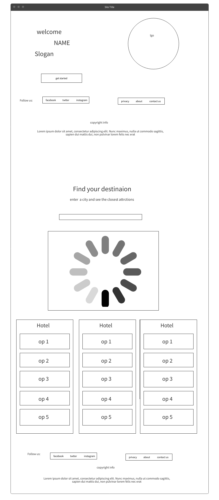
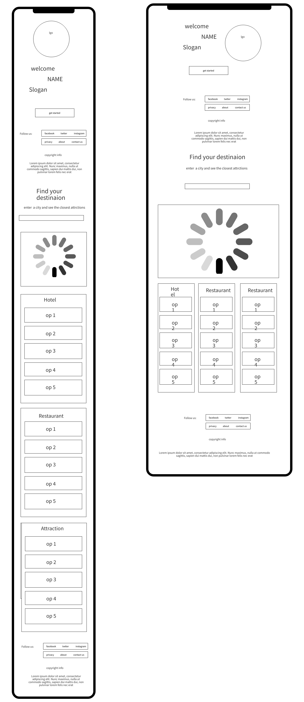

# Roamly – City Explorer Web App

[Link to Live Website](https://daniquej-r.github.io/Milestone-Proj-2/index.html)

[GitHub Repo](https://github.com/DaniqueJ-R/Milestone-Proj-2)

*** 

## About

Roamly is an interactive front-end web application that allows users to explore cities around the world and discover local attractions. Built with HTML, CSS, and JavaScript, the app uses the Google Maps and Places APIs to dynamically load location-specific content based on user input.

***

## Index – Table of Contents

* [User Experience](#user-experience)
     * [Purpose & Audience](#purpose-&-audience)
     * [Project Objectives](#project-objectives)
     * [Features](#features)
     * [Tech Stack](#tech-stack)
* [UX and Design](#ux-and-design)
* [Testing](#testing)
* [Deployment](#deployment)
* [Credits](#credit)

*** 

## User Experience

### Purpose & Audience
Roamly is designed for:

* **Travel enthusiasts** looking to research destinations
* **Casual users** interested in exploring cities interactively
* Users of all technical levels, with a **simple, clean interface** focused on **usability and accessibility**

### Project Objectives

The main goals of Roamly were to:

* Practice DOM manipulation and front-end interactivity
* Use an **external API (Google Places)** to dynamically fetch and render data
* Develop a mobile-responsive UI with basic accessibility features
* Integrate visual feedback (e.g., loading states, error messages)

### Features

* **Live city search** – Users enter a city name to explore
* **Dynamic map generation** via Google Maps API
* **Real-time points of interest** using Places API
* **Error handling** for empty input or invalid cities
* **Clean and responsive UI**, accessible on mobile and desktop

#### Out-of-Scope Features

##### Must

* **Add user login for saving favorite cities** - Allowes users to easly come back and find areas they ere lready interested in

* **Trip Type Selection** - Users can select the type of trip (relaxing, adventurous, cultural, romantic, etc.) to get personalized destination recommendations.

* **Trip Summary & Booking Suggestion** - Allowes user to wrap up planning with a summary and actionable next steps

##### Should

* **Add local weather info via OpenWeather API** - Helps users plan their trips better around weather reports

* **Travel Reminders & Duration Tools** - Gives reminders or tools to help decide how long to stay in each location or plan by days.

##### Could

* **Implement dark mode toggle for accessibility** - General asthetic change for users to change overall site to darker colours (eithher black or dark red)

* **Destination History** - Lets users see where they have searched, or planned to go in the past.

#### Scrapped Scope Features

* **Mood selector for trips**  - Initially, search was going to be mood based, however this was later scrapped for the trip type idea, giving the user easier options to custoomize their stay with.

### Tech Stack

* HTML5 & CSS3 (Flexbox layout, responsive design)
* Bootstrap for sizing and style assistance
* JavaScript (modular code, ES6 syntax)
* Google Maps JavaScript API
* Google Places API
* GitHub for version control and deployment

## UX and Design

* **Layout:** Clean card-based structure to group content visually
* **Accessibility:** Semantic HTML, good color contrast, large clickable elements
* **Responsiveness:** Viewport-based layout adapts on phones and tablets
* **Feedback:** Loading animation gives users status updates

Wireframes and design sketches were created during the planning stage. Check out the links below to explore the mobile, tablet, and desktop mockups: [Mockflow](https://app.mockflow.com/editor) (Please see samples below).

Consideration was given to desktop, tablet, and mobile users. The website is responsive through differing screen widths, with the final design being responsive at screen widths from 320-640px, 980-1200px, 1200-1600px, and 1600-5000px. This should ensure accessibility on any device or desktop monitor.

### Desktop Wireframe 

### Tablet/Phone Wireframe 

### Images

Photos were not used much in making this site, however, the logo was the main driving force behing the color, esign and overall feeling of the site.

Image(logo) was sourced from [Freepiks](https://freepiks.com/) for the homepage. Logo comes complete with alt attributes and/or Arial labels to support users with screen readers and the website's ranking.

## Testing

Please see my other ReadMe called [TestPlan.md](TestPlan.md) with a more detailed explination of my tests. 

Manual testing was conducted across key functions:

| Test Case                      | Expected                 | Result                   | Pass/Fail |
| ------------------------------ | ------------------------ | ------------------------ | --------- |
| Empty city input               | Show error message       | ✅ Error shown            | ✅         |
| Valid city (e.g., Paris)       | Map loads with markers   | ✅ Map and markers render | ✅         |
| Invalid city (e.g., gibberish) | Show no results message  | ✅ Error handled          | ✅         |
| Responsive layout              | Elements adapt on mobile | ✅ Adjusts well           | ✅         |
| Broken API or no network       | Shows graceful fallback  | ✅ User informed          | ✅         |

### Known Issues

* A brief delay occurs during data loading; a loader icon mitigates this.
* No 404 page yet for broken routes

### Code

Code has been tested using the [HTML Validator](https://validator.w3.org/) and [CSS Validator](https://jigsaw.w3.org/css-validator/) with the following results:

* **index.html** - 0 Errors / 0 Warnings

The warnings are due to 1) import of the Google fonts, 2) a webkit extension for Safari support of the flip-card effect used on the home page, and  3) using the root format for most colouring on the site (--var).

### Device

Testing was performed on the test scenarios listed in the table below to ensure visitors can view and interact with the Roamly website on differing devices.

To achieve a 'Pass,' the following criteria had to be met across all website pages;
1. All nav-menu links work as designed and lead to the correct locations. 
2. All images/videos are loaded and displayed correctly at the differing media queries
3. All text uses 'Montserrat Alternates' and 'Sofia Sans Semi Condensed' font style
4. All external links activate when clicked and open in a new tab or the app
5. The form as part of the 'Contact Us' page allows full completion and submission
6. The form as part of the 'Contact Us' page prevents the form from being sent unless all areas are filled
7. Header elements can be clicked to return users to the homepage from any site page
8. All pages retain layout integrity throughout the Body and across the differing media queries

| Device       | Type               | Pass | Partial Pass | Fail |                                                                                                                                                     |
| ------------ | ------------------ | ---- | ------------ | ---- | ---------------------------------------------------------------------------------------------------------------------------------------------------------------------------------------- |
| Mobile Phone | iPhone SE          | Pass |              |      |  |
| Mobile Phone | Samsung Galaxy S20 Ultra | Pass |              |      |
| Tablet       | iPad Air        | Pass |              |      |                                                                                   |
| Laptop       | ASUS Zenbook 14"   | Pass |              |      |                                                                                                     
### Accessibility

Each page of this website has been tested with [Wave (Web Accessibility Evaluation Tool)](https://wave.webaim.org/) with the following errors and recommendations that were fixed: 

* **2 Contrast Errors** Adequate text contrast is necessary for all users, especially users with low vision regarding the left and right controls in the testimonies area.

* **HTML5 video or audio** video defines videos such as movie clips or other video streams. Video content with audio must have synchronised captions and a transcript. Once a transcript is received, it will be updated.

* **Skipped heading level** The class titles' heading level is skipped on the classes page. This was fixed by changing them to H£ tags instead of h5, and the above were already H2 tags. 

## Deployment 

This project was deployed using the steps below, with the version releasing active. Please do not change files within this repository, as any changes pushed to the main branch will be automatically reflected on the live website. Instead, please follow the second set of steps, which will guide you to forking and cloning the website to make changes without impacting the live website. Thanks!

1. Logged into my [GitHub repository](https://github.com/DaniqueJ-R/Milestone-Project-1)
2. Click the "Settings" button in the main Repository menu.
3. Clicked "Pages" from the left-hand side navigation menu.
4. Within the Source section, click the "Branch" button and change from 'None' to 'Main' in the dropdown menu.
5. The page automatically refreshed with a URL displayed.
6. Tested the link by clicking on the URL.

The live website can be found here: https://daniquej-r.github.io/Milestone-Project-1/index.html.

To fork this website to either propose changes or to use it as an idea for another website, follow these steps:
1. If you haven't yet, you should set up Git. Don't forget to set up authentication to GitHub.com from Git as well.
2. Navigate to the [Milestone Project 1 GitHub repository](https://github.com/DaniqueJ-R/Milestone-Project-1).
3. Click the 'Fork' button on the upper right part of the page. It's in between 'Watch' and 'Star'.
4. You will now have a fork of the Milestone Project 1 repository added to your GitHub profile. Navigate to your profile and find the forked repository to add the required files.
5. Click the' Code' button Above the list of forked files.
6. A dropdown menu will appear, providing a choice of cloning options. Select the one that applies to your setup.
Further details on completing the final step are on the GitHub ['Fork a Repo'](https://docs.github.com/en/get-started/quickstart/fork-a-repo) page.

***

## Credit

### People

* Mentor Brian Macharia for guiding and advising throughout the project's lifecycle.
* Rick Atherton, Elaine Broche and Ilyascan OIgun are sources of information for README content and layout.
* Code Institute Slack community for peer reviewing the website.

### Software & Web Applications

* [Balsamiq](https://balsamiq.com/) - Used to build wireframes in the Skelton phase. 
* [GitHub](https://github.com/) - As a hosting repository for the deployment site. 
* [GitPod](https://gitpod.io/) and [Visual Studio Code](https://code.visualstudio.com/) - for writing the code. Using the command line for committing and pushing to Git Hub.  The website was coded using HTML, Bootstrap & CCS, with used for an IDE.
* [W3schools](https://www.w3schools.com/) - Source of 'How to...' information throughout the build.
* [Stackoverflow](https://stackoverflow.com/) - Source of 'How to...' information throughout the build.
* [iloveimg](www.iloveimg.com) - For compressing images to improve page load time.
* [Invideo.ai](https://ai.invideo.io/workspaces) - for generation placeholder video on the index page.
* [Wave](https://wave.webaim.org/) - Accessibility Testing to ensure content is readable for all users.
* [HTML Validator](https://validator.w3.org/) - For validating the HMTL code, no errors were found.
* [CSS Validator](https://validator.w3.org/) - For validating CSS code, no errors were found.
* [Code Beautify](https://codebeautify.org/) - For validating the HTML and CSS code layout.

### Code

* [Love Running](https://github.com/DaniqueJ-R/Love-Running-Template) - for inspiration on the schedule element and text overlay for the hero image and a reference for certain coding aspects throughout the build
* [Boardwalk Games](https://github.com/DaniqueJ-R/boardwalk-games) - for inspiration on the carousel, booking form, footer, and nav-bar elements, and a reference for certain coding aspects throughout the build
* [CodePen](https://codepen.io/Washable/pen/Oxqjbq) - For text-only carousel for testemonies.
* [stackoverflow](https://stackoverflow.com/questions/33642916/how-do-i-make-my-bootstrap-carousel-the-full-width-of-the-page) - For header carousel to cover screen with overlay

### Content

* [Google fonts](https://fonts.google.com/) - The free family font is used throughout the site for 'Montserrat Alternates' and 'Sofia Sans Semi Condensed'.
* [Font Awesome](https://fontawesome.com/) - Free social media icons sourced from FA.
* [Freepik](https://freepik.com) - Source of images for the entire build.
* [FitLab Studio](https://www.fitlabstudiosja.com/) - inspiration for general layout and social media icons in the nav area, as well as FAQs 
* [Pole People](https://polepeople.co.uk/) - inspiration for general layout and FAQ's

### Inspiration

* [FitLab Studio](https://www.fitlabstudiosja.com/) - inspiration for general layout and social media icons in the nav area, as well as FAQs 
* [Pole People](https://polepeople.co.uk/) - inspiration for general layout and FAQ's
* [Akila Pole Studio](https://www.akilapolestudio.com/)- Source of inspiration on design and features that improve accessibility. 
* [Diva Flow Pole](https://www.divaflowpole.com/)- Source of inspiration on design and features that improve accessibility. 
* [Ultimate Pole](https://www.ultimatepole.co.uk/classpacks) - Source of inspiration on design and features that improve accessibility. 

